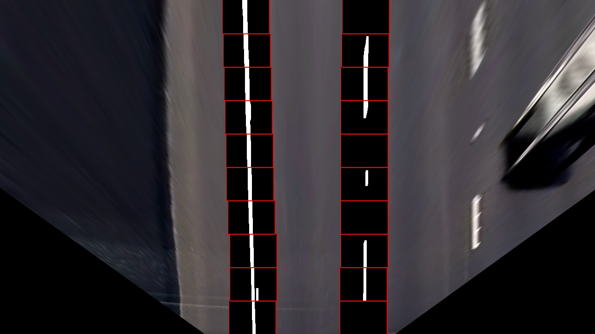
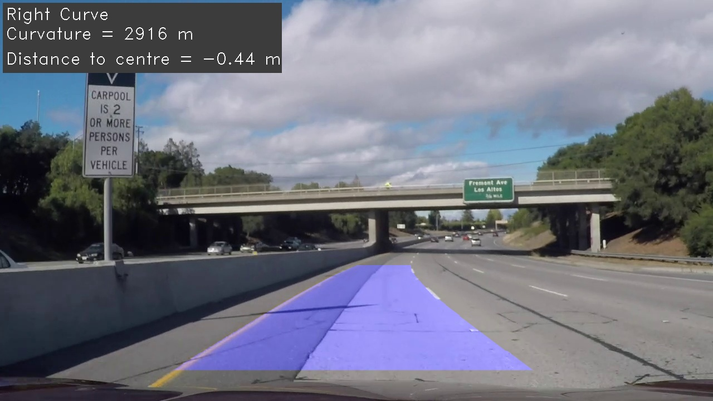

# Road Lane Detection

The goal of this project is to apply computer vision techniques in order to detect road lanes 
in the context of self-driving vehicles and advanced driving assistance systems.

## Installation
1. Create a python package.
2. Install numpy and opencv.
3. In main.py use project_video.mp4 or challenge_video.mp4
4. In case we want to use a different camera setup some calibrations are needed.
5. Run main.py

## Pipeline
1. **Setup**
2. **Perspective transform**
3. **Sliding window fit**
4. **Preprocessing and Thresholding**
5. **Polynomial fit**
6. **Data extraction and visualization**
7. **Backwards perspective transform**

## 1. Setup
First of all we need to make some preparations at the start of the program, we can compute some 
things that will be needed every frame in advance on the first frame.These things are the transformation matrices 
for the homographies as well as the points were it's likely the road lines will start. 

The latter is accomplished with the method `PreProcesing.getStartingPoints()` I have implemented. 
In this method we take the first frame, apply the projective homography and binarize it with the method `PreProcesing.binarize()`
that will be explained later. Once this is done we can assume two big concentrations of pixels will be present were the lines are.
If we produce a histogram with the sum of all white pixels in each horizontal point we will get two peaks where the lines should be
The starting points to start searching for lines are found in these peaks, so we can get the horizontal pixel that has the maximum 
amount of white pixels in each half on the image and start to search for the line there since it's the most likely place to contain the line.

We also create an object corresponding to each lane (left and right) so we can execute the search of each one in different threads.

## 2. Perspective Transform (bird-eyes view)
The next step is to apply a projective homography to change the perspective of the frame. 
We want to get a sort of "bird-view" perspective, for that que take the four corners of the lane 
and 4 others point that make a rectangle, and we get the transformation matrix that relates them 
with the method `cv2.findHomography()`, then we can apply `cv2.warpPerspective()` to transform 
the image to the new perspective.

## 3. Sliding Window Fit
Once we have the top-view image we can start the detection process. We will use the sliding window method,
for that we determine the number of windows we will iterate over and set their width, with `N windows` each one will 
have a height of `IMAGE_HEIGHT/N`. In this case we have a total of 10 windows so each one will be 72 pixels tall.

We take the starting points we got earlier and center the first window there. Then for each window we apply the methods 
`PreProcesing.bilateral_filter()` and `PreProcesing.binarize()`. This is done instead of binarizing the whole image to make the whole
program more efficient. Once the window is binarized we can store the x and y positions of all the white pixels that are 
contained within it, as once the search is done these pixels will be the ones used to fit a polynomial to each line. With each window iteration, if
the number of pixels found is higher than a threshold (650 in this case) we also compute the mean on the X axis 
of the pixels found and recenter the next window there, this is done to account for curve lines and not lose them.

When the window search is finished, and we have all the line pixels we can proceed to fit the polynomials, but first It's important
to understand how the `PreProcesing.binarize()` method works as it is where there is more room to change and experimentation.

### Visualization
This is not generated in this software, it is just a visualization of the process.

## 4. Preprocessing and Thresholding

### 1. Bilateral Filtering
First of all, we apply a bilateral filter to the window. This helps reduce noise and also smooths similar surfaces without
blurring the edges with is very useful for the context of our problem.

### 2. Brightness and Contrast Correction
Next we lower brightness and increase the contrast of the given window to reduce the impact of shadows and sudden light changes. 
We also transform the image to HSV colorspace and set the S value of all the image to 0 to lower the saturation which gives better results
when binarizing than simply transforming the image to Grayscale.

### 3. Binarizing
Last we perform the binarization process, which is composed of various ways of binarizing the image as we have to take into account 
the possibility of the lines being white or yellow, so the process must be robust to both cases. 

First, we threshold the brightness and contrast
corrected image and combine it with the thresholded B chanel of the original window image in LAB colorspace. We also apply a threshold
L channel of the LAB colorspace and the L channel from the HLS colorspace.

Then we apply some morphological transformations (TOPHAT) to the three versions in order to reduce very big concentration of pixels that are bigger than 
the lines should be from the window. After that we can finally combine the three thresholded images and apply erosion and dilation to remove noise and 
possible false positives from the window.

With this the binarizing process would be done. As said above here is where there is more room of improvement I think, as more methods can be tried. 
For example, I tried applying canny and sobel instead of binarizing but this was troublesome with shadows or vertical cracks on the road, so in the end
I decided on the binarizing method and found this combination of thresholds that provides good results.

## 5. Polynomial Fit
Once we have binarized all the windows, we can fit a second grade polynomial curve to the stored points. In this step we perform a sanity check
to see if the change of the curve is to abrupt compared with the last frame. We check the coefficient of x^2 in both curves as we don't expect much
change. If there is an abrupt change then we use the curve found in the last frame instead. 
All of this process is performed in `LaneFinder.findRoadLane()`

## 6. Data Extraction and Visualization
Once we have the two lines we can calculate the curvature of each one and the distance between the center of the vehicle and the center of the road lane. 
For the curvature we apply the curvature formula. We then use a couple different threads to show this data in the image and speed up the execution a bit.

This is actually processed at the same time as the lane backwards perspective transform and visualization.

We could use this data for driving assistance or for decision taking in self-driving. For example in this program
if the car gets to far away from the center the color of the found lane changes from green to red.

## 7. Backwards Perspective Transform
Finally, we apply a backwards perspective transformation to the lane image and add the lines to the original frame.

